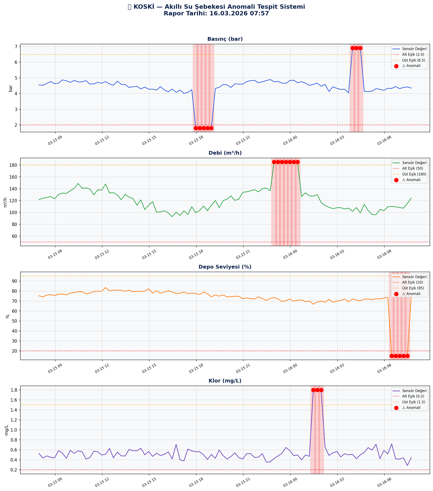

# 💧 Akıllı Su Şebekesi Anomali Tespit Sistemi

KOSKİ tipi SCADA verilerini analiz ederek boru patlaması, su kaçağı ve kritik seviye düşüşlerini otomatik tespit eden sistem.

## 🚨 Tespit Edilen Anomaliler

- 🔴 **Boru Patlaması** — Ani basınç düşüşü tespiti
- 🔴 **Su Kaçağı** — Aşırı debi anomalisi
- 🔴 **Kritik Depo Seviyesi** — Acil müdahale uyarısı
- 🟠 **Aşırı Klor** — Halk sağlığı riski tespiti
- 🟠 **Aşırı Basınç** — Boru hasarı riski

## 🗂️ Proje Yapısı
```
su_anomali_sistemi/
├── main.py              → Ana pipeline ve zamanlayıcı
├── sensor_uretici.py    → SCADA sensör verisi üretici
├── anomali_tespit.py    → Anomali tespit motoru
├── grafik_uretici.py    → Görsel rapor üretici
├── veri/                → CSV sensör verileri
├── grafikler/           → PNG anomali grafikleri
└── logs/                → İşlem kayıtları
```

## ⚙️ Kurulum
```bash
pip install numpy scipy matplotlib seaborn pandas openpyxl schedule
```

## ▶️ Çalıştırma
```bash
py main.py
```

## 📊 Örnek Grafik Çıktısı



## 📋 Örnek Çıktı
```
PIPELINE TAMAMLANDI!
   Toplam Anomali : 23 adet
   🔴 Kritik      : 17 adet
   🟠 Uyarı       : 6 adet
```

## 🛠️ Kullanılan Teknolojiler

- **Python 3.14**
- **NumPy & SciPy** — Sayısal analiz
- **Matplotlib & Seaborn** — Görselleştirme
- **Pandas** — Veri işleme
- **Schedule** — Zamanlayıcı

## 👤 Geliştirici

**Mehmet Kerem Akkuş** — Yazılım Mühendisi  
📧 kerem45akkus@gmail.com  
🔗 [github.com/keremakkuus](https://github.com/keremakkuus)
